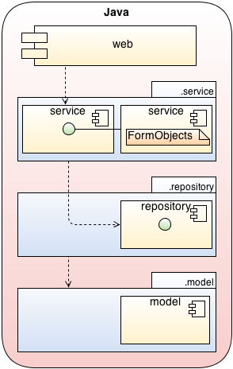
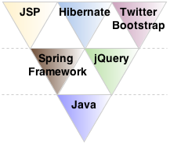

# Web project with Java using Spring Framework and Hibernate #

This example application consist of a small domain model with only simple business logic to add, remove and list departments and employees. This reference implementation serves as proof of concept to demonstrate the feasibility behind polyglot programming and polyglot programming pyramid. Simplicity of the application limits its ability to demonstrate some cases where different programming languages and paradigms might prove useful. This proof of concept is given to verify that the concept has the potential of being used.

## Project Structure ##

This project uses Maven for managing the project and its dependencies.

The project structure follows the four layer architecture of a simple web application. Domain model represent the real-world problem, repository provides the data access abstraction and service implements the business logic, whereas web module binds the whole application to the web environment.

## Polyglot Programming ##

Polyglot programming pyramid specifies the programming languages, frameworks and libraries used in the project. Java is the programming language of choice in this project. It is located in the stable layer of the polyglot programming pyramid, because it is the foundation that provides all the necessities for creating the domain model, the repositories and services, and the controllers in the web module. Spring Framework contributes to the dynamic layer by providing an efficient and versatile web application development framework for Java. Spring is an essential part of the web application implementation and its technologies contribute to all layers.

Domain layer contains different technologies targeting certain and concrete problem domains. Technologies located in the domain layer are usually utilized inside the other two layers to provide problem domain specific solutions. Hibernate annotations are used to create the object-relational mapping and validation of the domain model objects which is used in conjunction with Spring JPA Repository to provide the data access.

The web module contains web application specific components implemented on top of the Spring Framework and also the HTML view layer implemented with JSP. Twitter Bootstrap is used to enhance the content presentation and jQuery is utilized to provide dynamic features on the client-side.

### The MIT License (MIT) ###

Copyright (c) 2013 Juhana Harmanen

Permission is hereby granted, free of charge, to any person obtaining a copy of
this software and associated documentation files (the "Software"), to deal in
the Software without restriction, including without limitation the rights to
use, copy, modify, merge, publish, distribute, sublicense, and/or sell copies of
the Software, and to permit persons to whom the Software is furnished to do so,
subject to the following conditions:

The above copyright notice and this permission notice shall be included in all
copies or substantial portions of the Software.

THE SOFTWARE IS PROVIDED "AS IS", WITHOUT WARRANTY OF ANY KIND, EXPRESS OR
IMPLIED, INCLUDING BUT NOT LIMITED TO THE WARRANTIES OF MERCHANTABILITY, FITNESS
FOR A PARTICULAR PURPOSE AND NONINFRINGEMENT. IN NO EVENT SHALL THE AUTHORS OR
COPYRIGHT HOLDERS BE LIABLE FOR ANY CLAIM, DAMAGES OR OTHER LIABILITY, WHETHER
IN AN ACTION OF CONTRACT, TORT OR OTHERWISE, ARISING FROM, OUT OF OR IN
CONNECTION WITH THE SOFTWARE OR THE USE OR OTHER DEALINGS IN THE SOFTWARE.

